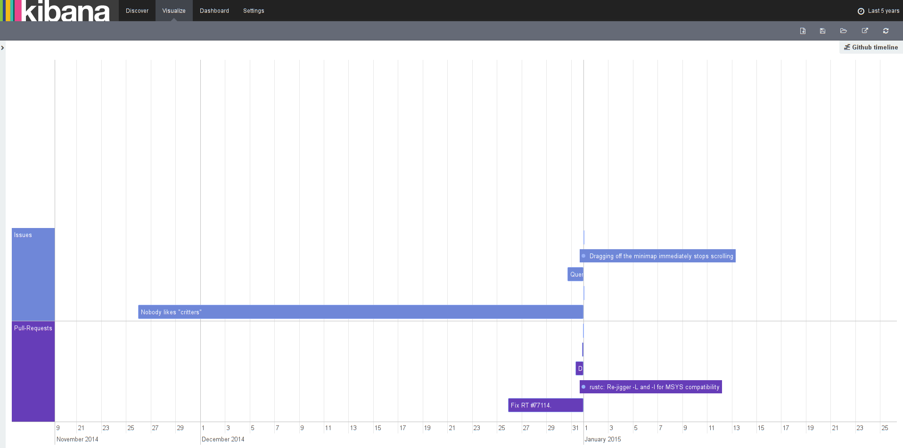

# Github Archive Dataset

Display events from Github. The data comes from https://www.githubarchive.org/.
With the timeline visualization, you can see for example the issues opened for a particular repository.

## Sample

```json
{
  "id": "2533570550",
  "type": "PushEvent",
  "actor": {
    "id": 3831984,
    "login": "gbrlmrllo",
    "gravatar_id": "",
    "url": "https://api.github.com/users/gbrlmrllo",
    "avatar_url": "https://avatars.githubusercontent.com/u/3831984?"
  },
  "repo": {
    "id": 22930547,
    "name": "inyxtech/inyxmater_rails",
    "url": "https://api.github.com/repos/inyxtech/inyxmater_rails"
  },
  "payload": {
    "push_id": 554949339,
    "size": 1,
    "distinct_size": 1,
    "ref": "refs/heads/master",
    "head": "f1e21b1d0e2569aeaa111a08c2bd9087d9a88db4",
    "before": "22f4f6719b2448c38baf9c32295759269309c7dd",
    "commits": [
      {
        "sha": "f1e21b1d0e2569aeaa111a08c2bd9087d9a88db4",
        "author": {
          "email": "f555d375048807db8b7f220ef3030fe1c898752f@gbrlmrllo-M2421.(none)",
          "name": "luprz"
        },
        "message": "dropdown css",
        "distinct": true,
        "url": "https://api.github.com/repos/inyxtech/inyxmater_rails/commits/f1e21b1d0e2569aeaa111a08c2bd9087d9a88db4"
      }
    ]
  },
  "public": true,
  "created_at": "2015-01-24T01:00:00Z"
}
```

## Data Loading

You can use the logtash configuration below for indexing the documents:

```rb
input {
  stdin {
  }
}
filter {
  json {
    source => "message"
  }
  mutate {
    remove_field => [ "message", "@version", "@timestamp", "host" ]
  }
}
output {
  elasticsearch {
    document_type => "2015"
    index => "githubarchive"
    hosts => ["127.0.0.1:9200"]
  }
}
```

## Configuration

Create a saved search with the query `type:IssuesEvent AND _exists_:payload.issue.created_at` to see Github issues. Then, set the timeline visualization to use that search. You will see something like below:


